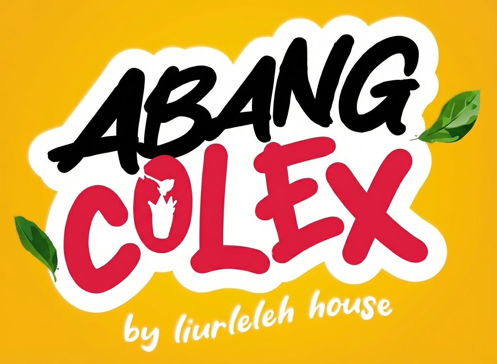

# 🌶️ ABANGCOLEK-OS (v4.2.0)
### The Autonomous Operating System for Abang Colek & Liurleleh House Malaysia
**Founded by Megat Shaifulreza (Epull) | TikTok: [@styloairpool](https://www.tiktok.com/@styloairpool)**  
*Built with Gemini 2.5, Google Workspace, Google Maps Platform, Supabase, and TypeSafe JEV System-1 Engine.*

---

<div align="center">
  
  <p><strong>"RASA PADU, PEDAS MENGGAMIT 🌶️🥭"</strong></p>
  <p><em>Sistem Operasi Peruncitan Pintar, Logistik Kargo Bas Ekspres & Ejen AI Pengurusan Stokis F&B Jalanan</em></p>
</div>

---

## 🌟 Ciri-Ciri Utama Sistem (Core Architecture)

### 1. ⚡ TypeSafe JEV System-1 Invariant Engine (<50ms)
- **Klasifikasi 7-Dimensi:** Menganalisis setiap mesej aduan pelanggan dan pesanan merentas dimensi *Brand*, *BusinessFunction*, *SalesChannel*, *CustomerIntent*, *IssueClass*, *ProcessStage*, dan *RootCauseStatus*.
- **Invarian Keselamatan Mutlak:** Sebarang aduan kerosakan botol (`LEAKAGE` / `SEAL_FAILURE`) dikunci ketat sebagai `UNDETERMINED` sehingga bukti nombor lot kilang atau bukti kurier disahkan secara saintifik.
- **Pencetus Automasi Google Workspace:** Menjana tugasan Google Tasks, draf emel baucar Gmail, lejar Google Sheets, dan temujanji Google Calendar secara automatik.

### 2. 🚚 Koridor Logistik Kargo Bas Ekspres & SOP 1 Jam
- **Hab Kargo Bas TBS:** Penghantaran pantas dari Terminal Bersepadu Selatan (TBS) ke terminal wilayah (MBKT Kuala Terengganu, Lembah Sireh Kota Bharu, Larkin Johor Bahru).
- **Amaran WhatsApp Automatik 1 Jam Sebelum:** Menghantar amaran ketibaan kargo berserta pautan WhatsApp dan kod **DuitNow QR** untuk bayaran tambang pemandu bas.

### 3. 🤖 Ejen Operasi Gemini 2.5 & Google Workspace (8 API)
- Bersepadu sepenuhnya dengan **Gmail**, **Google Calendar**, **Google Tasks**, **Google Docs**, **Google Sheets**, **Google Forms**, **Google Meet**, dan **Google Chat**.
- Dilengkapi **12 Plugin 3P** (Skyscanner, Booking.com, Canva, Adobe, GitHub, Vercel, Supabase, Mixpanel, COROS, Apple Health).
- Mengintegrasikan paradigma **Nous Research Hermes Agent** (memori berterusan & sintesis kemahiran kendiri) dan **DeepSeek-R1** (penaakulan dwi-fasa `<think>`).

### 4. ⌨️ Command Palette Pintar (Ctrl+K / Cmd+K)
- Navigasi segera antara 18+ ruang kerja dan alatan operasi dengan carian kata kunci pintar (*fuzzy search*).

### 5. 📚 Khazanah 172 Modul Kemahiran Kejuruteraan (`/skills/`)
- **Top 20 JEV Skills** (`skills/jev-core/`): Context compaction, memory winnow, graph navigation, ultrafast web execution, Canny verification gate.
- **Superpowers Suite** (`skills/superpowers/`): TDD berdisiplin, systematic debugging, subagent-driven development.
- **9 Domain Kejuruteraan**: Architecture, DevOps, Security, Analytics, Testing, Maintenance, Documentation.

---

## 🎨 Palet Warna Rasmi (Official Brandkit)

- **Colek Yellow / Gold:** `#FFC107`
- **Sambal Red / Chili:** `#E53935`
- **Midnight Black:** `#1A1A1A`
- **Cream White:** `#FFFDF7` / `#FFF8E1`
- **Mascot Blue:** `#4A90D9`

---

## 🚀 Pemasangan & Menjalankan Projek

```bash
# 1. Pasang kebergantungan pakej
npm install

# 2. Jalankan persekitaran pembangunan
npm run dev

# 3. Bina untuk pengeluaran (Production Build)
npm run build

# 4. Semakan kualiti jenis kod (TypeScript Check)
npm run lint
```

---

## 📄 Struktur Direktori Utama

```text
├── docs/                # Laporan penyelidikan rasmi & arkitektur JEV
├── public/assets/brand/ # Aset logo rasmi V2 & maskot Abang Colek
├── skills/              # 172 Modul kemahiran JEV, Superpowers & DevOps
│   ├── jev-core/
│   ├── superpowers/
│   └── ...
├── src/
│   ├── components/      # Antaramuka React (CommandPalette, Discovery, Freight, Maps, dsb.)
│   ├── services/        # Enjin JEV (jevEngine.ts), Gemini AI (gemini.ts), Supabase, Google
│   └── App.tsx          # Rangka utama aplikasi bertema jenama
└── tsconfig.json        # Konfigurasi TypeScript ketat
```

---

*Hak Cipta Terpelihara © 2026 Abang Colek oleh Liurleleh House Malaysia.*
